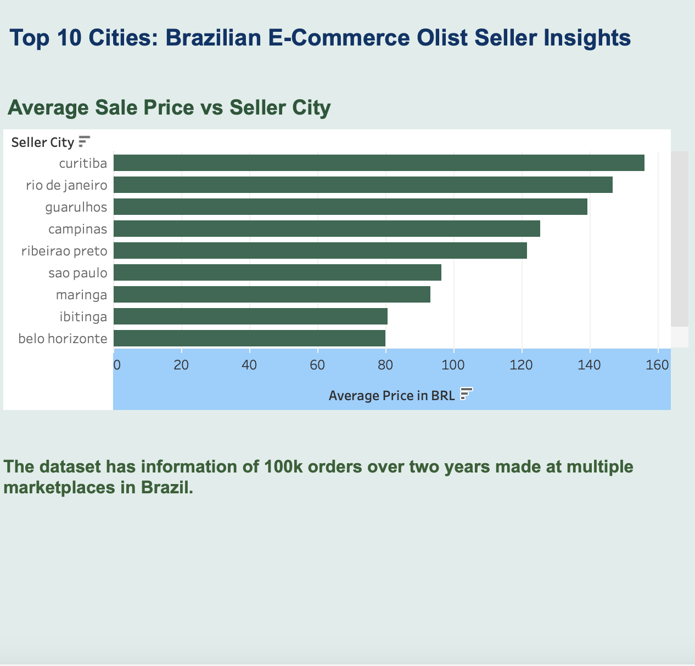

# Top10BrazilianEcommOlist
A set of dashboard visualizations showcasing the Top 10 cities with the highest average sale prices based on a Brazilian e-commerce dataset of 100,000 orders collected over two years.

This project includes interactive data visualizations built using tools such as Tableau, Plotly, and Streamlit. It explores key metrics from a Brazilian e-commerce dataset of 100,000 orders, with a focus on seller location, average sale prices, and freight costs. The dashboard highlights the top 10 cities by average order value and offers insights into regional pricing patterns across Brazil’s online marketplaces.

## Tools Used
- Tableau Public (for geospatial and comparative dashboards)
- Plotly (upcoming interactive visualizations)
- Streamlit (planned web apps and data exploration tools)
- Looker (Looker – for advanced BI modeling, semantic layer creation, and collaborative dashboards (in progress)

## Dataset
Sources: a cleaned dataset representing orders, sellers, and logistics.
`olist_orders_dataset.csv` 
`olist_order_items_dataset.csv`
`olist_sellers_dataset.csv`

## Live Dashboards
- [View Tableau Dashboard]([https://public.tableau.com/app/profile/lauren.schwartzenburg/viz/PalmerPenguinsAntarctica/DashboardMain?publish=yes](https://public.tableau.com/views/BrazillianE-Comm/BrazilianE-CommInsights?:language=en-US&:sid=&:redirect=auth&:display_count=n&:origin=viz_share_link)

## License
MIT License – free to use with attribution.
